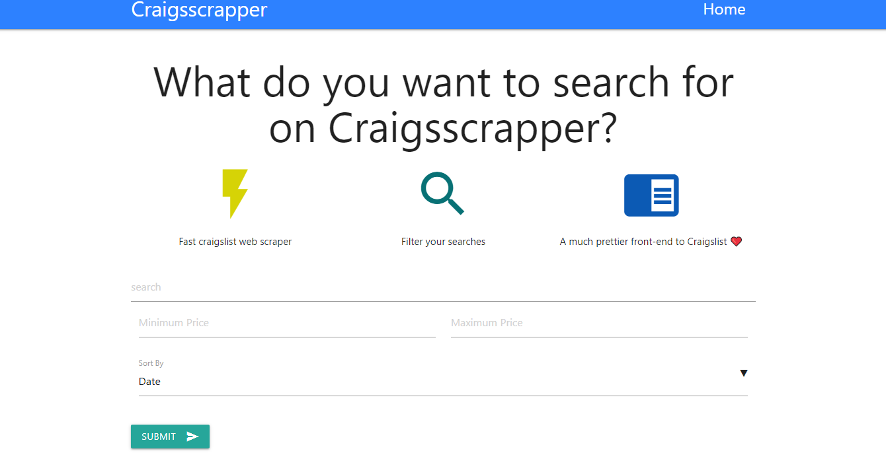
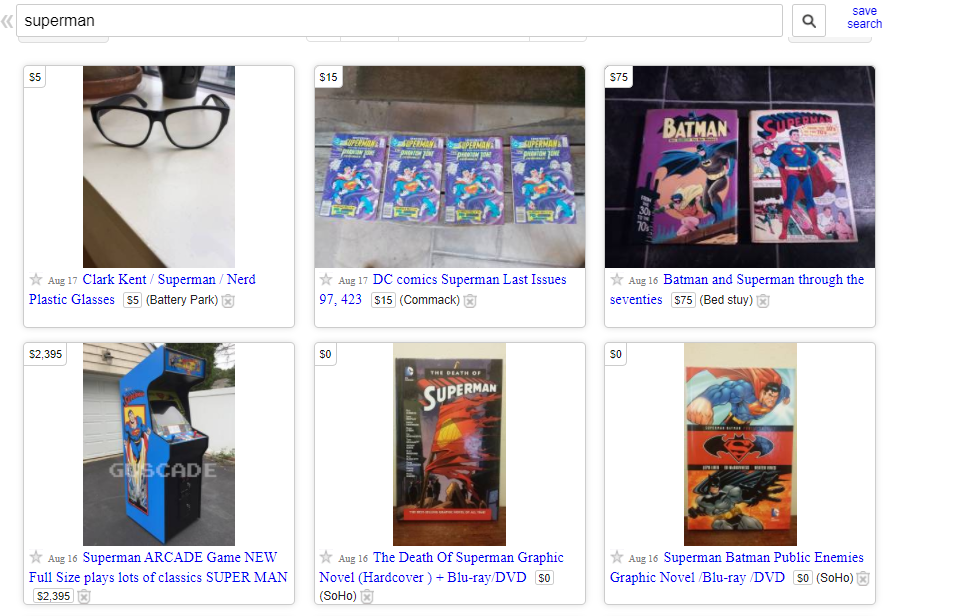
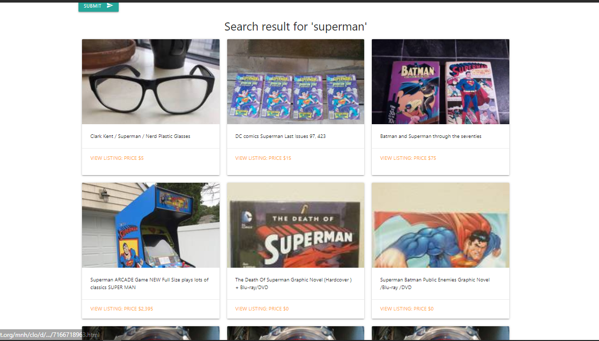

# craigsscrapper
crahsscrapper is a scraping website where anyone can search for any keywords in CraigList. Craigslist is an American classified advertisements website with sections devoted to jobs, housing, for sale, items wanted, services, community service, gigs, résumés, and discussion forums. Although it achieves billions page view per month , but it looks like total mess. craigscrapper will provide an easy search functionality on Craigslist with a nice UI.

## Features
- Text search
- Price filter with Sort option
- Shows results with a nice interface
## Screenshots

    
    
    

 

## Tools
- **[Django Framework 3.1](https://www.djangoproject.com/)**
- **[Python 3.8.5](https://www.python.org/)** 
- **[HTML5](https://html.com/)**
- CSS
- SqLite
### Link -> https://craigsscrapper.herokuapp.com/
